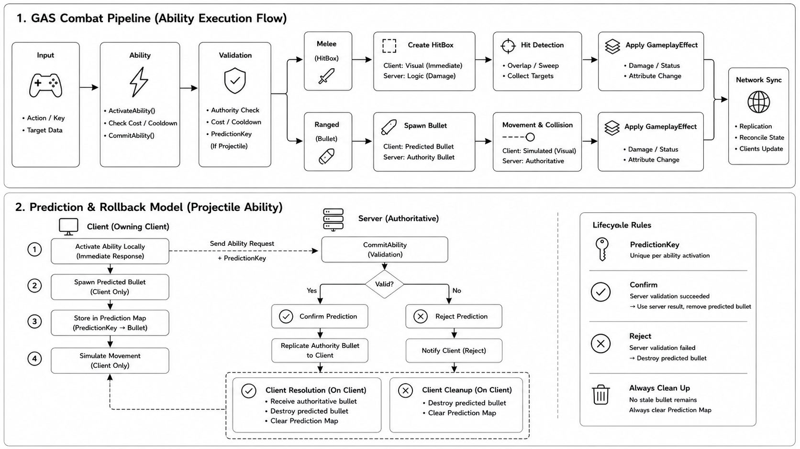

# Unreal-GAS-Multiplayer-Combat-System
🧠 Overview

## Overview

## 🎥 System play Video

# Unreal Engine GAS Multiplayer Combat System

A server-authoritative multiplayer combat system built with Unreal Engine's Gameplay Ability System (GAS), focused on ability lifecycle, client prediction, and reconciliation between predicted and authoritative gameplay state.

**The project was designed around several practical problems that appear in real-time multiplayer combat**:

- Keeping gameplay-critical combat state authoritative on the server while still providing immediate feedback to the local player.
- Managing predicted actions whose authoritative result may arrive later and may differ from the client's local state.
- Supporting melee and projectile abilities through a consistent execution model rather than implementing separate networking logic for every skill.
- Separating ability execution, animation, hit detection, gameplay effects, and skill configuration so each responsibility can evolve independently.

## Key Design Decisions

**Server-authoritative combat**  
Clients can initiate abilities locally for responsiveness, but gameplay-critical decisions remain under server authority. Ability validation, hit results, and GameplayEffects are resolved through the authoritative gameplay state rather than trusting client-side presentation.

**Prediction and reconciliation**  
Projectile abilities can create immediate local feedback before the authoritative server result arrives. `FPredictionKey` associates predicted execution with the corresponding server action, allowing predicted objects to be confirmed, replaced, or removed when authoritative state is received.

This keeps network latency from directly determining perceived responsiveness while preserving the server as the final source of truth.

**Consistent ability lifecycle**  
Abilities follow a common activation and execution flow built around GAS rather than implementing networking and state management independently for each combat action. Costs, cooldowns, animation, execution, and ability termination therefore remain part of a predictable lifecycle.

**Separation of combat responsibilities**  
Ability logic coordinates execution, while animation, hit detection, attributes, GameplayEffects, and presentation remain separate concerns. This prevents individual abilities from becoming large classes responsible for every part of the combat pipeline.

**Data-driven ability configuration**  
GameplayTags and DataAssets are used to describe skill identity and configuration independently from execution logic, making the system easier to extend with additional abilities without duplicating the surrounding combat architecture.

## Features

- GAS-based melee and projectile abilities
- Server-authoritative combat
- Client-side prediction and reconciliation
- `FPredictionKey`-based projectile matching
- GameplayEffects and AttributeSets
- GameplayTags
- Montage-driven ability execution
- Melee hit detection and projectile combat
- Data-driven skill configuration

The following diagram illustrates the full combat pipeline and the prediction/rollback model used for projectile abilities.

 
